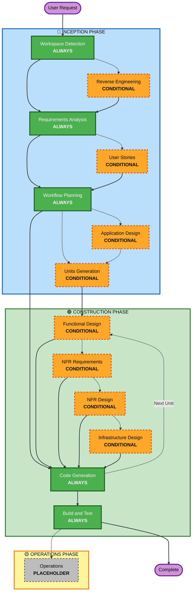

# AI-DLC Adaptive Workflow Overview

**Purpose**: Technical reference for AI model and developers to understand complete workflow structure.

**Note**: Similar content exists in welcome-message.md (user welcome message) and README.md (documentation). This duplication is INTENTIONAL - each file serves a different purpose:
- **This file**: Detailed technical reference with Mermaid diagram for AI model context loading
- **welcome-message.md**: User-facing welcome message with ASCII diagram
- **README.md**: Human-readable documentation for repository

## The Three-Phase Lifecycle:
• **INCEPTION PHASE**: Planning and architecture (Workspace Detection + conditional phases + Workflow Planning)
• **CONSTRUCTION PHASE**: Design, implementation, build and test (per-unit design + Code Generation + Build & Test)
• **OPERATIONS PHASE**: Placeholder for future deployment and monitoring workflows

## The Adaptive Workflow:
• **Workspace Detection** (always) → **Reverse Engineering** (brownfield only) → **Requirements Analysis** (always, adaptive depth) → **Conditional Phases** (as needed) → **Workflow Planning** (always) → **Code Generation** (always, per-unit) → **Build and Test** (always)

## How It Works:
• **AI analyzes** your request, workspace, and complexity to determine which stages are needed
• **These stages always execute**: Workspace Detection, Requirements Analysis (adaptive depth), Workflow Planning, Code Generation (per-unit), Build and Test
• **All other stages are conditional**: Reverse Engineering, User Stories, Application Design, Units Generation, per-unit design stages (Functional Design, NFR Requirements, NFR Design, Infrastructure Design)
• **No fixed sequences**: Stages execute in the order that makes sense for your specific task

## Your Team's Role:
• **Answer questions** in dedicated question files using [Answer]: tags with letter choices (A, B, C, D, E)
• **Option E available**: Choose "Other" and describe your custom response if provided options don't match
• **Work as a team** to review and approve each phase before proceeding
• **Collectively decide** on architectural approach when needed
• **Important**: This is a team effort - involve relevant stakeholders for each phase

## AI-DLC Three-Phase Workflow:



**Stage Descriptions:**

**🔵 INCEPTION PHASE** - Planning and Architecture
- Workspace Detection: Analyze workspace state and project type (ALWAYS)
- Reverse Engineering: Analyze existing codebase (CONDITIONAL - Brownfield only)
- Requirements Analysis: Gather and validate requirements (ALWAYS - Adaptive depth)
- User Stories: Create user stories and personas (CONDITIONAL)
- Workflow Planning: Create execution plan (ALWAYS)
- Application Design: High-level component identification and service layer design (CONDITIONAL)
- Units Generation: Decompose into units of work (CONDITIONAL)

**🟢 CONSTRUCTION PHASE** - Design, Implementation, Build and Test
- Functional Design: Detailed business logic design per unit (CONDITIONAL, per-unit)
- NFR Requirements: Determine NFRs and select tech stack (CONDITIONAL, per-unit)
- NFR Design: Incorporate NFR patterns and logical components (CONDITIONAL, per-unit)
- Infrastructure Design: Map to actual infrastructure services (CONDITIONAL, per-unit)
- Code Generation: Generate code with Part 1 - Planning, Part 2 - Generation (ALWAYS, per-unit)
- Build and Test: Build all units and execute comprehensive testing (ALWAYS)

**🟡 OPERATIONS PHASE** - Placeholder
- Operations: Placeholder for future deployment and monitoring workflows (PLACEHOLDER)

**Key Principles:**
- Phases execute only when they add value
- Each phase independently evaluated
- INCEPTION focuses on "what" and "why"
- CONSTRUCTION focuses on "how" plus "build and test"
- OPERATIONS is placeholder for future expansion
- Simple changes may skip conditional INCEPTION stages
- Complex changes get full INCEPTION and CONSTRUCTION treatment

---

## Subagent Invocation Convention

**CRITICAL**: All subagent invocations across every stage MUST use the following explicit format. The phrase "Invoke X subagent" alone is NOT sufficient — the main model MUST use the Agent tool; acting as the subagent role itself is **prohibited**.

```
Use the Agent tool with subagent_type: "<agent-name>"
- Blocking: <yes|no>
- Inputs: <plan path / unit name / specific context to pass>
- On failure: <route fixes back to codegen agent / surface error to user>
- Audit: append to aidlc-docs/audit.md — format below
```

**Mandatory audit entry** for every subagent invocation:
```markdown
## Subagent Invocation — <agent-name>
**Timestamp**: [ISO 8601]
**Stage**: [stage name]
**Unit**: [unit name or N/A]
**Purpose**: [one-line description]
**Result**: [PASS / FAIL / summary]
---
```

If a step says "CONDITIONAL" and the condition is not met, log `"<agent-name> N/A — <reason>"` to audit.md instead.

---

## Subagent Orchestration Matrix

Every stage below lists which subagent applies and whether invocation is MANDATORY or CONDITIONAL.

| Phase | Stage | Subagent | Rule |
|-------|-------|----------|------|
| INCEPTION | Reverse Engineering | `aidlc-researcher` | CONDITIONAL — unfamiliar tech stack |
| INCEPTION | Requirements Analysis | `tmf-knowledge-ingest` | CONDITIONAL — TMF unit + stale oracle |
| INCEPTION | Application Design | `aidlc-researcher` | CONDITIONAL — new components needing pattern research |
| CONSTRUCTION | NFR Requirements | `aidlc-researcher` | CONDITIONAL — performance SLA / compliance benchmarks needed |
| CONSTRUCTION | Infrastructure Design | `codegen-iac` | CONDITIONAL — new AWS resources or IaC pattern validation |
| CONSTRUCTION | Code Generation (Step 10.5) | `codegen-backend` / `codegen-db` / `codegen-frontend` / `codegen-iac` | **MANDATORY** — always dispatch to matching stack subagent |
| CONSTRUCTION | Build and Test (Step 2.5) | `qa-tester` | **MANDATORY** — always |
| CONSTRUCTION | Build and Test (Step 4.4) | `tmf-knowledge-ingest` | CONDITIONAL — stale oracle before TMF review |
| CONSTRUCTION | Build and Test (Step 4.5) | `tmf-compliance-reviewer` | CONDITIONAL — TMF-standard unit only |
| CONSTRUCTION | Build and Test (Step 5.5) | `web-integration-tester` | CONDITIONAL — frontend or mixed unit |

**N/A logging**: When a CONDITIONAL subagent is skipped, the stage is NOT complete until the N/A reason is logged to audit.md.

**Codegen sub-table**: All `codegen-*` subagents in Step 10.5 must comply with `common/codegen-principles.md` (Karpathy 4 원칙 + Kent Beck TDD). Compliance entry in audit.md is mandatory after every codegen subagent completes.
